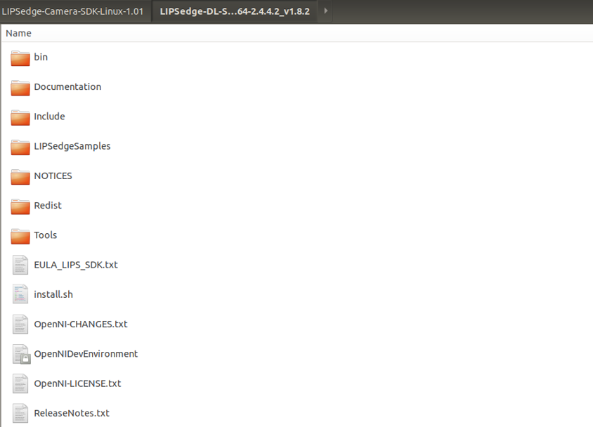

# A. Windows Installation(x64)



To access the SDK, visit [https://www.lips-hci.com/3d-camera](https://www.lips-hci.com/3d-camera) and procure the package for the preferred version, framework, and compatible operating system.

1. Visit [LIPS SDK & Downloads](https://www.lips-hci.com/3d-camera) website.

2. Under **LIPSedge**™ **Camera SDK**, select SDK file to download the installation file based on the preferred version, framework, and compatible operating system.
3. Download, extract and execute the downloaded file.

4. Click **Next**.

5. Click Next.

6. Select **the SDK installation location** and click **Next**.

7. From the top menu, select the type of installation for the host PC: In this case, it is recommended to select **Custom Installation > LIPSedge™ camera SDK**. \
   \- **Full Installation**: Install all LIPSedge™ SDKs with all system dependencies for all available LIPSedge™ camera models.\
   \- **Compact Installations**: Install LIPSedge™ SDK with minimum system dependencies for the chosen model.\
   **- Custom Installation**: Install LIPSedge™ SDK with limited functionality for the chosen model.

8. Click **Install**.

9. Click **Finish**.

10. Once the installation is successful, the LIPSedge™ SDK and its relevant components are accessible at C:\Program Files\LIPSedge Camera SDK x.xx.

11. The LIPSedge™ SDK is also accessible from the desktop shortcut.

12. The desktop shortcut folder contains:

* **Browse LIPSedge SDK Samples**: A ink to [LIPS Corp.'s GitHub for example applications](https://github.com/lips-hci/LIPSedge-sdk-samples)
* **Browse LIPSedge SDK Wrappers**: Link to [LIPS Corp.'s GitHub for the supported wrapper's source code.](https://github.com/lips-hci/LIPSedge-sdk-wrappers)
* **Download Latest SDK**: Link to [LIPS Corp's official website for the latest SDK](https://www.lips-hci.com/lipssdk)
* **LIPS tools source code**: Contains a series of executable tools and the source code of these tools.
* **lips-hci.com**: Link to LIPS Corp’s official website.
* **NiViewer**: An image viewer for streaming RGB / depth images. Refer to\
  _3-A-c Camera Access_.
* **OpenNI2 Programming API**: A link to OpenNI API’s programming guide.
* **Release Notes**: Announcement of the latest feature.
* **Run LIPS tools**: Contains a series of executable tools.
* **Uninstall LIPSedge™ SDK**: A quick uninstallation link for LIPSedge™ SDK.



LIPSedge™ camera utilizes NIViewer, OpenNI’s signature tool, for examining and assessing the quality of depth, RGB, and point cloud image.

1. From the Start menu, start NIViewer.

**Note**: If users use Linux platform. Please follow command below to activate NiViewer.

2. Upon activation, a **Status Window**, and a **Viewer Window** both pop

<figure><figcaption></figcaption></figure>

3. The **Status Window** displays the camera information, such as SDK build version, SDK time stamp, camera ID, status. This example utilizes LIPSedge™ DL.

4. The **Viewer Window** displays the Depth image on screen.

5. Press **\[p]** to activate **the pointer mode**. The meter below shows the depth data of the given point marked by the indicator.

6. Optionally choose an area to display by dragging a cropping area with the cursor. The rest of the areas will be masked from displaying.

7. Optionally press F to maximize / minimize the viewer’s window.

**Note**: If for any reason the USB cable is forcibly removed while NiViewer is functioning, an **ERROR! Device disconnected** message appears on the screen. To resume livestreaming, re-plug the USB cable.

8. Optionally press C to capture the current screen as a raw format file. To access the raw format file, go to **LIPSedge™ camera SDK > OpenNI2 > Tools > CaptureFrames** and drag the captured image file to the **Ni2RawViewer.exe**. For details, refer to _5.1 LIPSedgeSamples_.

9. If by accident the camera is abruptly connected, the camera will automatically restore the camera connection.




NIViewer relies on hotkeys, which are listed in the help menu, to control its functionality and adjustments. By default, the menu in NIViewer is hidden to provide an unobstructed viewing experience. To access this menu, press Shift + ?.

**Note**: LIPSedgeTM M3 only supports depth / IR images and functions. IR images will be displayed when functions involving color streaming is selected.

| Default – The help menu hidden                                        | The help menu displayed                                                        |
| --------------------------------------------------------------------- | ------------------------------------------------------------------------------ |
|  | .png>) |

The help menu provides the following functionalities:

**General**

* **Show / Hide Help Screen \[Shift + ?]**: Shows the **Help Screen** which contains the description of keyboard shortcuts with their functions.
* **Esc**: Exits the NIViewer.

**Preset**

* **Presets**: Displays the depth / color images in 11 styles. Press the hotkey mentioned by the screen hint to select the image styles. By default, depth / color images are displayed **Side By Side**. In this example, LIPS Corp. demonstrates a way to assess the depth image quality using the psychedelic depth style with the pointer mode \[p].

**-Psychedelic depth \[3]**: Visualizes the depth images in a psychedelic style, aiding in the evaluation of image capturing presentation and quality. The stream has a resolution of 640 \* 480 fps.

33.3 represents the depth value from the camera lens to the object.

<figure><figcaption></figcaption></figure>

Move the pointer towards the adjacent yellow segment to assess the width between yellow segments in depth value.

<figure><figcaption></figcaption></figure>

**Display**

* **Pointer Mode On / Off \[p]**: Enables **Pointer Mode** to show a red dot, which indicates the depth value (unit: mm), representing the distance from the camera lens to the object located at a specific point on the image.

<figure><figcaption></figcaption></figure>

* **Full Screen On / Off \[p]:** Displays the camera images in full screen or turns the full screen display off.
* **Reset IR histogram \[h]:** Clears the IR histogram.
* **Show / hide help screen \[?]:** Shows the **Help Screen** which contains the description of keyboard shortcuts with their functions.

**Device**

* **Depth-Color Frame Sync \[y]**: Synchronize the timing between depth / color images.
* **Depth-IR Frame Sync \[u]**: Synchronize the timing between depth / color images.
* **Zoom crop on / off \[z]:** Enable / disable a cropping mode that magnifies the displayed area, focusing on a specific region of the image.
* **Mirror All \[m]**: Flips the streaming image horizontally for every stream.
* **Reset all croppings \[/]**: Reset the cropping area previously assigned.
* **Toggle Auto Exposure \[a]**: Automatically adjusts exposure settings for optimal image quality.
* **Toggle AWB \[q]**: Enables or disables automatic white balance adjustment.
* **Increase Exposure \[e]**: Raises the camera's exposure level for brighter images.
* **Decrease Exposure \[E]**: Lowers the camera's exposure level for darker images.
* **Increase Gain \[g]**: Enhances image brightness by increasing the camera's gain.
* **Decrease Gain \[G]**: Reduces gain to control image brightness.
* **Toggle Close Range \[x]**: Toggles between close-range and default focus settings.
* **Toggle Image Registration \[i]**: Activates or deactivates image registration.
* **IR Emitter On / Off \[t]**: Turns the infrared emitter on or off for depth image capture.

**Player**

* **Pause / Resume \[Space]:** Pauses the playback of the recording or resumes playback.
* **Read one Frame \[;]**: This function appears only when the playback is paused. Click to load the playback image of the next frame.

**Capture**

* **Start \[s]**: Assigns a path for saving the recording files and start recording images.
* **Start (5 sec delay) \[d]**: Starts to record images 5 seconds upon clicking this function.
* **Stop \[x]**: Stops recording camera image.
* **Capture current frame only \[c]**: Saves the current frame as an image file.



This section is <mark style="color:red;">**NOT**</mark> applicable to this model.



