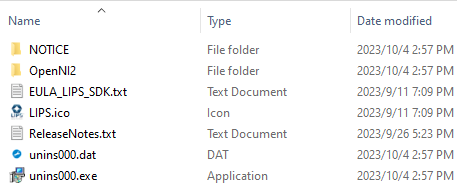
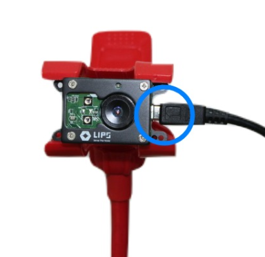

# 3.2 SDK Knowledge Base  sdfgs




* **NOTICE**: Dependent libraries necessary for LIPSedge™ camera SDK functionality. Do NOT modify or delete the folder content.
* **OpenNI2**: OpenNI-related files that are essential for camera integration and function control, including system configuration files and example applications.
* **Auxiliary files**: Supplementary information for the LIPSedge™ camea SDK.
  * **EULA\_LIPS\_SDK.txt**: The end user agreement.
  * **LIPS.ico**: LIPS Corp.’s icon which appears during application operation.
  * **ReleaseNotes**: Announcement of the latest feature.
* **Uninstallation components**: Run unins000.exe for uninstallation. Note that unins000.dat must be present.

**\[OpenNI2 Folder]**

The SDK package for LIPSedge™ camera provides a comprehensive set of files and folders to support camera integration and development. These resources include OpenNI C++ API documentation, header files, libraries for compilation, sample applications, system files, and important information such as licenses and release notes.

* **Documentation**: Contains essential OpenNI C++ API documentation.
* **Include**: Contains essential OpenNI C++ headers. These headers can be checked along with the associated library files to facilitate development.
* **Lib**: Contains library files, specifically OpenNI2.lib and realsenses2.lib. These libraries are used in conjunction with MS Visual Studio C++ for compilation.
* **LIPSedgeSamples**: Contains a series of executable tools and the source code of these tools.
* **Redist**: Contains network configuration files, camera drivers and system files necessary for image streaming.
* **Tools**: Holds captured frames from example programs and other camera configuration files.
* **CHANGES**: The change log for OpenNI.
* **LICENSE**: Contains information about the licensing terms for the SDK.
* **NOTICE**: Contains copyright and attribution notices relevant to the OpenNI components.
* **ReleaseNotes**: The latest system requirements for OpenNI.



In LIPSedge™ camera SDK (OpenNI based) for the Linux system, the folders are structured in a way that the OpenNI2 and dependency files are **adjacent to the application that requires these external resources**.

Go to **./home/LIPSedge-Camera-SDK-Linux/LIPSedge\[Model]-SDK** for OpenNI C++ API documentation, header files, libraries for compilation, sample applications, system files, and important information such as licenses and release notes.

* **bin**: Consists of the USB driver files for the LIPS camera.
* **Documentation**: Contains essential OpenNI C++ API documentation.
* **Include**: Contains essential OpenNI C++ headers. These headers can be checked along with the associated library files to facilitate development.
* **LIPSedgeSamples**: Contains a series of executable tools and the source code of these tools.
* **Redist**: Contains network configuration files, camera drivers and system files necessary for image streaming.
* **Tools**: Holds captured frames from example programs and other camera configuration files.
* **EULA\_LIPS\_SDK.txt**: The end user agreement.
* **Install.sh**: In cases where the Linux / Ubuntu SDK installation was aborted, execute install.sh to install the SDK.
* **OpenNI-CHANGES.txt**: The change log for OpenNI.
* **OpenNI-LICENSE.txt**: Contains information about the licensing terms for OpenNI.
* **NOTICE**: Contains copyright and attribution notices relevant to the OpenNI components.
* **ReleaseNotes**: The latest system requirements for OpenNI.


