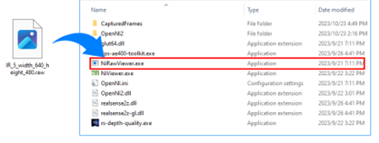

# E. Ni2CenterRead

1\.     In Bin, click Ni2CenterRead.exe.

<figure><figcaption></figcaption></figure>

&#x20;

2\.     A simple OpenNI2 console program to show depth value at center point of frame.

<figure><figcaption></figcaption></figure>
