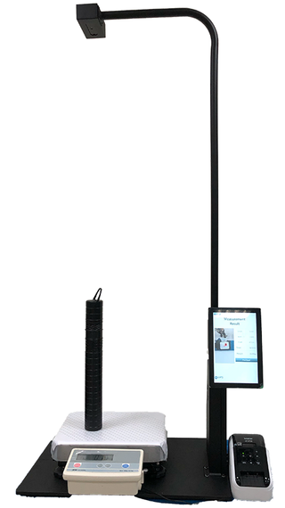

# 7.2 Middlewares



<table><thead><tr><th width="123.66666666666666"></th><th></th><th></th></tr></thead><tbody><tr><td>xxxx</td><td>3D Body Pose Middleware</td><td>Camera SDK</td></tr><tr><td>xxxx</td><td>3D Virtual Fence Middleware</td><td>Camera SDK/CMS</td></tr></tbody></table>



<table><thead><tr><th width="120.66666666666666"></th><th></th><th></th></tr></thead><tbody><tr><td>xxxx</td><td>LIPScan™ 3D SDK</td><td>SDK/API</td></tr><tr><td>xxxx</td><td><del>3D Desktop Software</del></td><td><del>Desktop Software</del></td></tr><tr><td>xxxx</td><td>LIPScan™ 3D APP</td><td>Standard/Professional Edition</td></tr></tbody></table>

.png>)

<figure><figcaption></figcaption></figure>



<table><thead><tr><th width="120.66666666666666"></th><th></th><th></th></tr></thead><tbody><tr><td>xxxx</td><td>SW200 2D Facial Recognition</td><td>Camera SDK</td></tr><tr><td>xxxx</td><td>SW500 3D Facial Recognition</td><td>Camera SDK</td></tr></tbody></table>



.png>)

